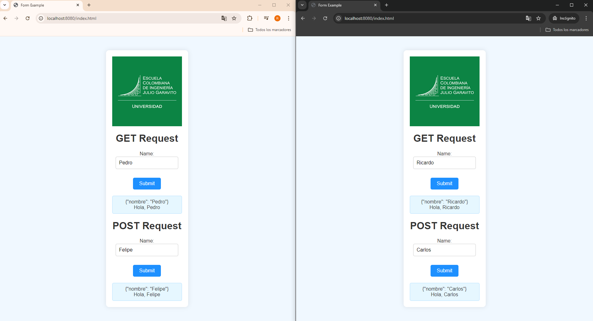
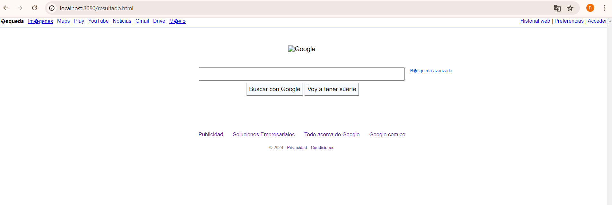
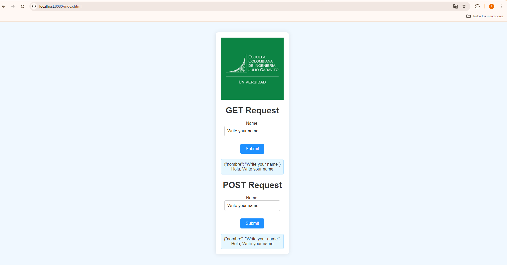
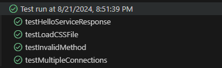
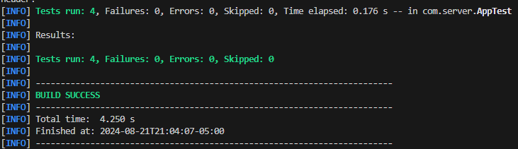
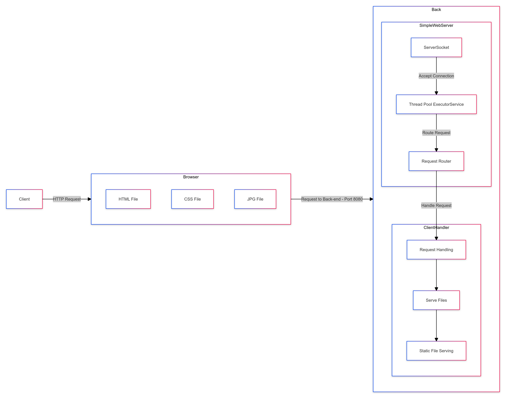
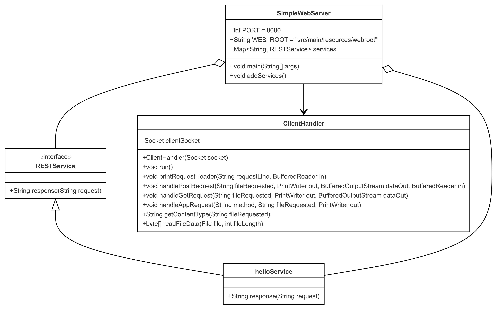

# ConcurrentWebServer

This program implements a basic concurrent web server capable of serving static files and handling multiple requests simultaneously using a thread pool.

The following image is an example of the proyect functionality.

 

## Starting

### Previous requirements

It is necessary to have "**Maven**" and "**Java**" installed, preferably in their latest versions.

### * Maven
  ```
  Download Maven at http://maven.apache.org/download.html 

  Follow the instructions at http://maven.apache.org/download.html#Installation
  ```
### * Java

  ```
  Download Java at https://www.java.com/es/download/ie_manual.jsp
  ```

### Running

In order to use the project on your system, you can access the following link and download a compressed file of it.

You can also clone the file using the following command.

```
git clone https://github.com/Richi025/AREP-ConcurrentWebServer.git
```
if you want to run the application use the command.

```
java -jar .\target\AREP-ConcurrentWebServer-1.0-SNAPSHOT.jar 
```


### Installing

Once you have the cloned project in your repository. Follow the steps below to launch the program successfully

1. Open a terminal and enter the folder where I clone the repository.

2. Use the following command to compile and clean the target directory.
      ```
      mvn clean compile
      ```
3. Now use the following command to package the project as a JAR file.

      ```
      mvn package
      ```

4. Now you can run the project using the following command.

      ```
      java -jar .\target\ARSW-ConcurrentWebServer-1.0-SNAPSHOT.jar 
      ```

5. Once the program is running, open a browser and enter the following links.

* http://localhost:8080/resultado.html


  

* http://localhost:8080/index.html

  

* http://localhost:8080/google.jpg

  


## Running the tests

To run the tests you can use the following Maven command

```
mvn test
```





### Test Descriptions

#### 1. `testHelloServiceResponse()`

- **Objective**: Verifies if the `helloService` responds correctly to a GET request with a `name` parameter in the URL.
- **Steps**:
  - Sends a GET request to the URL `/app/hello?name=JohnDoe`.
  - Reads the server's response.
  - Checks if the response contains the expected JSON `{"nombre": "JohnDoe"}` and the Spanish text `Hola, JohnDoe`.
- **Expected Result**: The test passes if the service correctly returns a response that includes both the JSON and the Spanish greeting.

#### 2. `testLoadCSSFile()`

- **Objective**: Verifies if the server can correctly serve a static CSS file.
- **Steps**:
  - Sends a GET request to the URL `/style.css`.
  - Checks the HTTP response code.
- **Expected Result**: The test passes if the server returns a 200 response code, indicating that the CSS file was found and served correctly.

#### 3. `testInvalidMethod()`

- **Objective**: Verifies that the server correctly handles unsupported HTTP methods (in this case, `DELETE`).
- **Steps**:
  - Sends a `DELETE` request to the URL `/app/hello?name=John`.
  - Checks the HTTP response code.
- **Expected Result**: The test passes if the server returns a 405 (Method Not Allowed) response code, indicating that the `DELETE` method is not allowed for this URL.

#### 4. `testMultipleConnections()`

- **Objective**: Verifies the server's ability to handle multiple simultaneous connections.
- **Steps**:
  - Sends four concurrent GET requests to the URL `/index.html`.
  - Each request checks the HTTP response code.
- **Expected Result**: The test passes if all concurrent requests receive a 200 response code, indicating that the server can handle multiple connections efficiently and without errors.


## Arquitecture

  

### Components

+ **Client**

  Represents the user or application that makes HTTP requests to the server. The client sends HTTP requests to the browser, which then processes them.

+ **Browser**

  This is the component that receives the HTTP request from the client. The browser is responsible for managing the interaction with the client, rendering HTML, CSS, and image (JPG) files that are received from the backend or loaded locally. The diagram represents three types of files:

  - **HTML File:** The HTML file that contains the structured content of the web page.
  - **CSS File:** The CSS file that defines the style and presentation of the web page.
  - **JPG File:** A JPG image file that can be displayed as part of the visual content on the web page.

+ **Back (Backend)**

  This is the server that handles incoming requests from the browser. It consists of several subcomponents that manage connection, routing, and request handling.

+ **SimpleWebServer**

  This component is the core of the backend and is responsible for accepting client connections, managing a thread pool to handle multiple requests simultaneously, and routing the requests to the appropriate handlers.

  - **ServerSocket:** Accepts incoming connections from clients (browsers). It is the entry point for all HTTP requests.
  - **Thread Pool (ExecutorService):** A pool of threads that allows handling multiple connections concurrently, improving server efficiency.
  - **Request Router:** A component responsible for routing HTTP requests to specific handlers based on the requested URL.

+ **ClientHandler**

  This subcomponent is responsible for processing each incoming request. Once the Request Router determines the appropriate handler, the ClientHandler executes the necessary logic to respond to the request.

  - **Request Handling:** Here, the specific client request is processed, whether to serve a static file or handle a specific operation.
  - **Serve Files:** Manages the delivery of requested files, such as HTML, CSS, images, etc., to the client.
  - **Static File Serving:** Specifically handles serving static files like images, stylesheets, scripts, etc.

## Class Diagram

  

### Component Explanation

+ **RESTService**
  - This is an interface that defines the contract `response(String request)` for the classes that implement it.

+ **helloService**
  - Implements the `RESTService` interface, providing the specific logic for the `response` method.

+ **SimpleWebServer**
  - This is the main class that configures the web server, including setting up the port, the server root, and adding services.

+ **ClientHandler**
  - Responsible for handling individual client connections, processing GET and POST requests, and serving files.


## Built with

* [Maven](https://maven.apache.org/) - Dependency management
* [java](https://www.java.com/es/) - Programming language

## Versioned

We use [Git](https://github.com/) for version control. For available versions, see the tags in this repository.

## Authors

* **Jose Ricardo Vasquez Vega** - [Richi025](https://github.com/Richi025)

## Date

Wednesday, August 21, 2024

## License

This project is licensed under the GNU license; See the [LICENSE.txt](LICENSE.txt) file for details.